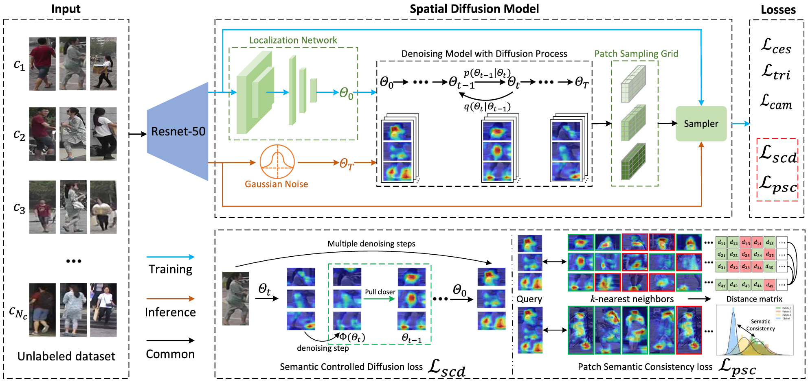

# Unsupervised Learning of Intrinsic Semantics With Diffusion Model for Person Re-Identification (PISL)
Official PyTorch implementation of [Unsupervised Learning of Intrinsic Semantics With Diffusion Model for Person Re-Identification](https://ieeexplore.ieee.org/abstract/document/10804086/) (TIP 2024).

## Updates
- [04/2025] Code is released.

## Overview

Unsupervised person re-identification (Re-ID) aims to learn semantic representations for person retrieval without using identity labels. Most existing methods generate fine-grained patch features to reduce noise in global feature clustering. However, these methods often compromise the discriminative semantic structure and overlook the semantic consistency between the patch and global features. To address these problems, we propose a Person Intrinsic Semantic Learning (PISL) framework with diffusion model for unsupervised person Re-ID. First, we design the Spatial Diffusion Model (SDM), which performs a denoising diffusion process from noisy spatial transformer parameters to semantic parameters, enabling the sampling of patches with intrinsic semantic structure. Second, we propose the Semantic Controlled Diffusion (SCD) loss to guide the denoising direction of the diffusion model, facilitating the generation of semantic patches. Third, we propose the Patch Semantic Consistency (PSC) loss to capture semantic consistency between the patch and global features, refining the pseudo labels of global features. Comprehensive experiments on three challenging datasets show that our method surpasses current unsupervised Re-ID methods. 

## Requirements
- Python 3.7+
- PyTorch 1.7.0+
- CUDA 10.2+
- faiss-gpu 1.6.3 and 1.7.2
- scikit-learn
- numpy
- scipy
- tqdm
- h5py
- pandas

## Getting Started
### Installation
```shell
git clone https://github.com/taoxuefong/Diffusion-reid
cd Diffusion-reid
python setup.py develop
```

### Faiss Version Compatibility
The code has been tested with different versions of faiss. If you are using faiss version 1.7.2, please use the following utility files:
- Replace `pisl/utils/faiss_utils.py` with `pisl/utils/faiss1.7.2_utils.py`
- Replace `pisl/utils/faiss_rerank.py` with `pisl/utils/faiss1.7.2_rerank.py`

These files contain version-specific implementations to ensure compatibility with faiss 1.7.2.

### Preparing Datasets
```shell
cd examples && mkdir data
```
Download the object Re-ID datasets [Market-1501](https://drive.google.com/file/d/0B8-rUzbwVRk0c054eEozWG9COHM/view), [MSMT17](https://arxiv.org/abs/1711.08565), and [VeRi-776](https://github.com/JDAI-CV/VeRidataset) to `Diffusion-reid/examples/data`.
The directory should look like
```
Diffusion-reid/examples/data
├── Market-1501-v15.09.15
├── MSMT17_V1
└── VeRi
```

## Implementation Details

### Model Architecture
- Backbone: ResNet-50 pretrained on ImageNet
- Feature dimension: 2048
- Number of parts: 3 (configurable via `--part` argument)
- Diffusion steps: 1000
- Beta schedule: Cosine schedule

### Training Strategy
1. **Feature Extraction**
   - Global features and part features are extracted using ResNet-50
   - Features are L2 normalized before clustering

2. **Pseudo Label Generation**
   - DBSCAN clustering with Jaccard distance
   - Adaptive threshold based on dataset characteristics
   - Outlier handling with unique labels

3. **Semantic Consistency Learning**
   - Patch Semantic Consistency (PSC) loss
   - Label smoothing and refinement
   - Camera-aware contrastive learning

4. **Diffusion Model Training**
   - Spatial Diffusion Model (SDM) for patch generation
   - Semantic Controlled Diffusion (SCD) loss
   - Denoising process with cosine schedule

### Hyperparameters
- Learning rate: 0.00035 (default)
- Weight decay: 5e-4
- Batch size: 64 (default)
- Number of instances per identity: 4 (default)
- DBSCAN eps: 0.4-0.7 (dataset dependent)
- Camera contrast weight: 0.5 (default)
- Diffusion loss weight: 0.1 (default)

## Training
We utilize 4 Tesla T4 GPUs or 2080Ti for training.
We use 384x128 sized images for Market-1501 and MSMT17 and 256x256 sized images for VeRi-776.

### Training with camera labels
For Market-1501:
```shell
CUDA_VISIBLE_DEVICE=0,1,2,3 \
python examples/train_pisl_cam.py \
-d market1501 --eps 0.4 --logs-dir $PATH_FOR_LOGS
```

For MSMT17:
```shell
CUDA_VISIBLE_DEVICE=0,1,2,3 \
python examples/train_pisl_cam.py \
-d msmt17 --eps 0.6 --lam-cam 1.0 --logs-dir $PATH_FOR_LOGS
```

For VeRi-776:
```shell
CUDA_VISIBLE_DEVICE=0,1,2,3 \
python examples/train_pisl_cam.py \
-d veri -n 8 --height 256 --width 256 --eps 0.7 --logs-dir $PATH_FOR_LOGS
```

### Training Arguments
- `-d, --dataset`: Dataset name (market1501, msmt17, veri)
- `-b, --batch-size`: Batch size (default: 64)
- `-j, --workers`: Number of data loading workers (default: 4)
- `-n, --num-instances`: Number of instances per identity (default: 4)
- `--height`: Input image height (default: 384)
- `--width`: Input image width (default: 128)
- `--part`: Number of parts (default: 3)
- `--eps`: DBSCAN distance threshold (default: 0.5)
- `--lam-cam`: Weight for camera contrastive loss (default: 0.5)
- `--lam-diff`: Weight for diffusion loss (default: 0.1)
- `--logs-dir`: Directory to save logs and models

## Testing 
We use a single Tesla T4 GPU for testing.

For Market-1501:
```shell
CUDA_VISIBLE_DEVICE=0 \
python examples/test.py \
-d market1501 --resume $PATH_FOR_MODEL
```

For MSMT17:
```shell
CUDA_VISIBLE_DEVICE=0 \
python examples/test.py \
-d msmt17 --resume $PATH_FOR_MODEL
```

For VeRi-776:
```shell
CUDA_VISIBLE_DEVICE=0 \
python examples/test.py \
-d veri --height 256 --width 256 --resume $PATH_FOR_MODEL
```

### Evaluation Metrics
- Mean Average Precision (mAP)
- Cumulative Matching Characteristics (CMC) at Rank-1, Rank-5, Rank-10
- Single-query evaluation protocol

## Acknowledgement
Some parts of the code is borrowed from [SpCL](https://github.com/yxgeee/SpCL).

## Citation
If you find this code useful for your research, please consider citing our paper

```BibTex
@ARTICLE{tao2024unsupervised,
  author={Tao, Xuefeng and Kong, Jun and Jiang, Min and Lu, Ming and Mian, Ajmal},
  journal={IEEE Transactions on Image Processing}, 
  title={Unsupervised Learning of Intrinsic Semantics With Diffusion Model for Person Re-Identification}, 
  year={2024},
  volume={33},
  number={},
  pages={6705-6719},
  doi={10.1109/TIP.2024.3514360}
}
```

